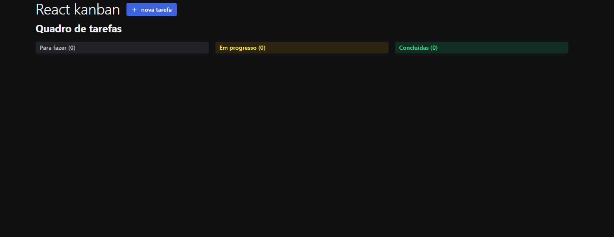

## App pesquisa de filme

Projeto lista de tarefas onde podemos adicionar tarefas por um formulario atualizar e remover, estando totalmente responsivo

### ⚙️ Acesar o projeto

[Endereço](https://react-kanban-com-typescript.vercel.app/)

### 🛠️ Tecnologias utilizadas

- HTML

- CSS

- TYPESCRIPT

- REACT

- API

- RadixUI

### 🙋🏻‍♂️ AUTOR

João Vitor - Fullstack do projeto - [Github](https://github.com/JoaoVitor2004)

### Licensa

Este projeto foi feito com a licensa [MIT](https://pt.wikipedia.org/wiki/Licen%C3%A7a_MIT)